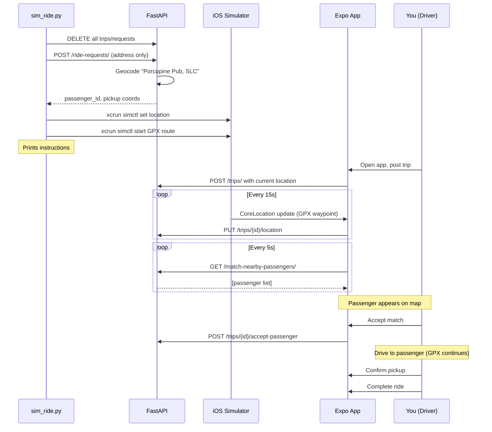
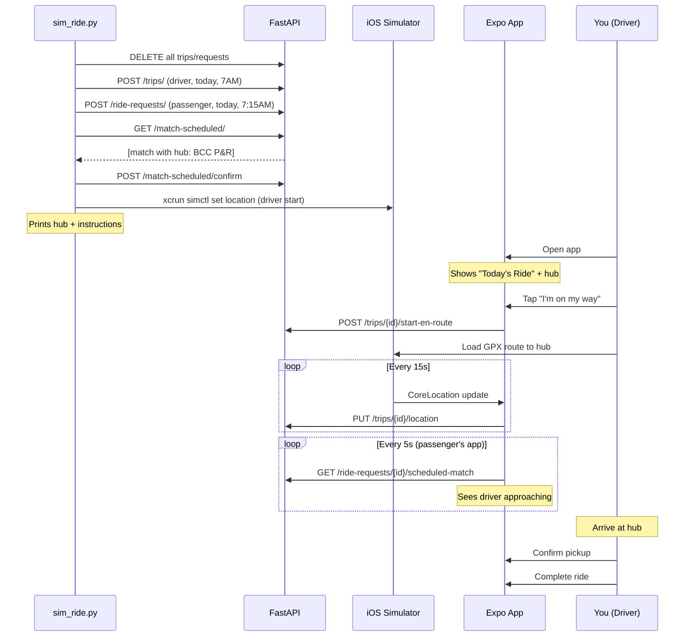

# Test Verification Steps

## Implementation Complete

All features have been implemented:
- ✓ Address-based endpoint tests with geocoding validation
- ✓ GPX route files for realistic route simulation
- ✓ sim_ride.py script for Ride Now and Scheduled simulations
- ✓ dev.sh commands: `sim-ride` and `sim-sched`

## Next Steps: Verification

The test run was interrupted due to database connection loss. To verify everything works:

### 1. Restart the Development Environment

```bash
# Terminal 1: Stop and restart
./dev.sh stop
./dev.sh local
```

Wait for: `API will be available at: http://localhost:8080`

### 2. Run API Tests (Fast Version First)

```bash
# Terminal 2: Fast test without geocoding
python3 test_flows.py --skip-geocoding
```

Expected result: All 22 tests pass in ~5 seconds

### 3. Run API Tests with Geocoding

```bash
# Terminal 2: Full test with geocoding validation
python3 test_flows.py
```

Expected result: All tests pass (takes ~10-15 seconds due to Nominatim calls)
Check `test_report.md` for geocoding accuracy details

### 4. Test Ride Now Simulation

```bash
# Terminal 2:
./dev.sh sim-ride solitude
```

Expected output:
```
✓ Database wiped
✓ Passenger created (ID: X)
✓ Simulator location set to (40.6409, -111.8175)
✓ GPX route started: gpx/route_to_solitude.gpx

Instructions:
1. Open the Expo app on iOS Simulator
2. Select 'Ride Now' and 'Driver'
3. Post a trip to Solitude
4. You should see the passenger on your map
...
```

Then:
- Open Expo app on iOS Simulator
- Post trip as driver
- Verify passenger appears
- Watch GPX route play (your location updates every 15s to API)
- Accept match -> Confirm pickup -> Complete ride

### 5. Test Scheduled Ride Simulation (Driver)

```bash
# Terminal 2:
./dev.sh sim-sched solitude driver
```

Then:
- Open Expo app
- See "Today's Ride" with hub
- Tap "I'm on my way"
- Watch yourself drive to hub
- Confirm pickup -> Complete

### 6. Test Scheduled Ride Simulation (Passenger)

```bash
# Terminal 2:
./dev.sh sim-sched solitude passenger
```

Then:
- Open Expo app as passenger
- See "Today's Ride" with hub
- Watch driver marker move toward hub (automated via background script)
- Confirm pickup when driver arrives

---

## What Was Implemented

### 1. Address-Based Tests ([test_flows.py](test_flows.py))

**Changes:**
- Location pools now include full addresses with city/state (e.g., "Marriott Downtown, Salt Lake City, UT")
- Tests send addresses only (no lat/lng) by default
- Validates geocoded coordinates are within 5km of expected location
- Added `--skip-geocoding` flag for fast iteration

**Geocoding validation:**
```python
# For drivers
driver_data = {
    "start_location_text": "Marriott Downtown, Salt Lake City, UT",
    # No current_lat/current_lng sent
}
# API geocodes -> validates returned start_lat/start_lng

# For passengers
passenger_data = {
    "pickup_text": "Porcupine Pub & Grille, Salt Lake City, UT",
    # No lat/lng sent
}
# API geocodes -> validates returned pickup_lat/pickup_lng
```

### 2. GPX Route Files

Created three realistic routes following actual canyon roads:

| File | Description | Waypoints | Use Case |
|------|-------------|-----------|----------|
| `gpx/route_to_solitude.gpx` | Engen Hus B&B → Solitude Resort | 10 | Ride Now driver simulation |
| `gpx/route_to_park_city.gpx` | Kimball Junction → Park City Mtn | 6 | Ride Now to Park City |
| `gpx/route_to_hub_bcc_pr.gpx` | Midvale → Big Cottonwood P&R | 6 | Scheduled ride to hub |

**Why these routes:**
- Follow actual road geometry (not straight-line interpolation)
- Waypoints every ~2-5 minutes for realistic speed
- Compatible with `xcrun simctl location` command

### 3. Simulation Setup Script ([sim_ride.py](sim_ride.py))

**Features:**
- Wipes DB for clean state
- Seeds test data using **text addresses** (validates geocoding)
- Sets iOS Simulator location via `xcrun simctl location booted set`
- Optionally starts GPX route playback via `xcrun simctl location booted start`
- Supports both Ride Now and Scheduled modes
- Supports both driver and passenger perspectives (scheduled only)

**For scheduled passenger perspective:**
- Automatically starts `simulate_realtime_tracking.py` in background
- Driver moves toward hub automatically
- Passenger sees driver approaching in real-time

### 4. Dev.sh Integration

**New commands:**
```bash
./dev.sh sim-ride [resort]          # Defaults to solitude
./dev.sh sim-sched [resort] [role]  # Defaults to solitude driver
```

Examples:
```bash
./dev.sh sim-ride solitude
./dev.sh sim-ride park_city
./dev.sh sim-sched solitude driver
./dev.sh sim-sched solitude passenger
```

---

## How the Full Flow Works

### Ride Now End-to-End



### Scheduled Ride (Driver Perspective)



---

## Key Insights

### Why This Approach Works

1. **Expo app already polls location** -- sends PUT every 15s automatically
2. **CoreLocation reads from Simulator** -- GPX waypoints feed directly into the app
3. **No backend changes needed** -- API already has location update endpoints
4. **Realistic route geometry** -- GPX files follow actual canyon roads
5. **Validates geocoding** -- tests use addresses, catching real user issues

### What Gets Tested

#### API Tests
- ✓ Geocoding accuracy for all seeded locations
- ✓ Full ride lifecycle state transitions
- ✓ Matching algorithms (geometry, seats, timing)
- ✓ Edge cases (cross-resort, seat overflow)

#### Simulator Tests
- ✓ Real-time location tracking (Expo -> API)
- ✓ Progressive matching (passenger appears as you drive)
- ✓ UI responsiveness
- ✓ Map rendering and route drawing
- ✓ Pickup prompts at correct distances
- ✓ Hub-based meetings (scheduled rides)

---

## Comparison: Old vs New

### Before
- Tests used lat/lng directly (skipped geocoding)
- No location movement simulation
- Manual setup required for each test
- No automated DB seeding for Simulator tests

### After
- Tests use addresses (validates geocoding pipeline)
- GPX routes simulate realistic driving
- One command sets up entire simulation
- Automated DB wipe + seeding + Simulator setup
- Background driver simulation for passenger perspective
